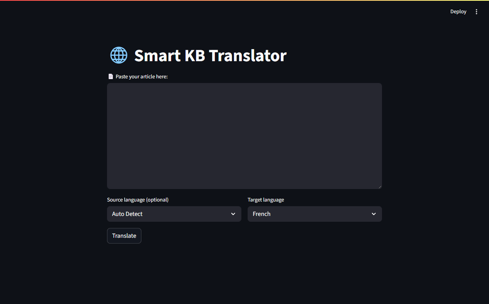

# 🌐 Smart KB Translator

This is a dual-mode AI translation tool that allows you to translate articles or documents either through the **command line** or a **simple Streamlit web interface**. It uses a shared translation engine and can be customized to support various LLM backends such as Ollama or OpenAI.

---

## 📁 Project Highlights

* ✅ **Streamlit Web App** for interactive translation.
* ✅ **CLI Tool** for power users and batch operations.
* ✅ **Shared core translation logic** for both modes via `Agent.translator`.
* ✅ Markdown-aware translation with formatting preservation.
* ✅ Optional source language support and model flexibility.

---

## 🚀 Quick Start

### 🔧 Installation

1. Clone/download the project.
2. Run the `setup.bat` (Windows) to set up dependencies and environment.
3. Ensure [Ollama](https://ollama.com/) or your LLM of choice is installed and configured.
4. (Optional) Edit `config.json` to set default model and preferences.

---

## 🖥️ Streamlit Web UI

Launch the web interface:

```bash
streamlit run app.py
```

### Features:

* Paste or upload article content.
* Choose source and target languages.
* Preview or download translated content.

### Screenshot



---

## 🧪 CLI Tool

Run translation from the terminal:

```bash
python translate_cli.py path/to/your.md --target Japanese
```

Optional arguments:

```bash
-s, --src         Source language (optional)
-t, --target      Target language (required)
-o, --output-dir  Output directory for translated file
```

### Example:

```bash
python translate_cli.py examples/sample.md --src English --target Thai --output-dir output/
```

Output file: `sample_translated.md` in the specified folder.

---

## 🔁 Translation Engine

Both modes use a shared class:

```python
# Agent/translator.py

class Translator:
    def translate(self, text: str, src_lang: str = None, target_lang: str = None) -> str:
        ...
```

* Customize model logic in `translate()` method.
* Preserves Markdown and technical structure.
* Handles inline strings or full documents.

---

## 📁 File Structure Overview

```
📦 Project Root
┣ 📂Agent/
┃ ┣ 📜ocr.py
┃ ┗ 📜translator.py  ← core translation logic
┣ 📜app.py           ← Streamlit web interface
┣ 📜translate_cli.py ← CLI for file-based translation
┣ 📜config.json      ← Model & assistant settings
┣ 📜setup.bat        ← Setup script (Windows)
┣ 📜requirement.txt
┗ 📜LICENSE
```

---

## 📄 License

This project is licensed under the **GNU General Public License v3.0 (GPL-3.0)**.

You are free to use, modify, and distribute this software under the terms of the GPL.
See the [LICENSE](LICENSE) file for full terms.
